# Advanced Health & Exercise Analysis

This document presents insights from your exercise sessions and their impact on your sleep quality, generated by running [detailed_analysis.py](file:///home/ztejksa/.gemini/antigravity-cli/brain/fc6e6de7-5fb2-4ea5-aa8f-02a1183c6483/scratch/detailed_analysis.py) on your health database.

---

## 🏃‍♀️ 1. Workout Summaries & Intensity
Your training is divided into four main activities. Treadmill running is your most intense workout, while stationary biking represents your longest steady-state workouts.

| Workout Type | Sessions | Avg Duration | Total Hours | Avg BPM | Avg Max BPM |
| :--- | :---: | :---: | :---: | :---: | :---: |
| **Treadmill Running (34)** | 77 | 38.9 mins | 49.9 hrs | 97 | 97 |
| **Stationary Biking (5)** | 73 | 42.2 mins | 51.3 hrs | 84 | 84 |
| **Running (58)** | 48 | 23.8 mins | 19.1 hrs | 104 | 104 |
| **Rowing (53)** | 1 | 39.1 mins | 0.7 hrs | 163 | 163 |

---

## 🫀 2. Heart Rate Zone Distribution
By mapping your heart rate samples during exercise into zones (using a standard max HR of 185 BPM), we can see the exact physiological stimulus of each activity type:

* **Warm Up** (<111 BPM)
* **Fat Burn** (111–130 BPM)
* **Aerobic** (130–148 BPM)
* **Anaerobic** (148–166 BPM)
* **Peak** (>166 BPM)

```mermaid
gantt
    title Workout Intensity Focus
    dateFormat  X
    axisFormat %
    section Treadmill Running
    Warm Up (18%) : active, 0, 18
    Fat Burn (25.4%) : 18, 43
    Aerobic (26.1%) : 43, 70
    Anaerobic (27.3%) : 70, 97
    Peak (3.1%) : 97, 100
    section Stationary Biking
    Warm Up (32.8%) : active, 0, 33
    Fat Burn (42.2%) : 33, 75
    Aerobic (23.9%) : 75, 99
    Anaerobic (1.0%) : 99, 100
    section Running (58)
    Warm Up (36%) : active, 0, 36
    Fat Burn (28.4%) : 36, 64
    Aerobic (30.1%) : 64, 94
    Anaerobic (5.4%) : 94, 100
```

### Key Takeaways:
* **Treadmill Running (34)** is highly intense: You spend **over 30% of your time** in Anaerobic and Peak zones (above 148 BPM).
* **Stationary Biking (5)** is a classic low-intensity steady-state (LISS) exercise, with **75% of your workout** spent in Warm Up or Fat Burn zones (below 130 BPM).

---

## 💤 3. Workout Day vs. Rest Day Sleep
There is a **very strong correlation** between working out and sleep quality. 

### Sleep Duration
On days when you recorded a workout, you slept significantly longer than on rest days:
* **Workout Day Sleep**: **6.28 hours** average (90 sessions measured)
* **Rest Day Sleep**: **5.43 hours** average (119 sessions measured)

> [!TIP]
> Exercising correlates with an average of **45 additional minutes of sleep** per night.

### Absolute Recovery Time Gain
While the percentage breakdown of sleep stages remains relatively stable, the extra 45 minutes of total sleep on workout days results in a substantial gain in absolute physical and cognitive recovery time:

* **Deep Sleep (Stage 5)**:
  * Rest Day: 45.6 mins
  * Workout Day: **51.6 mins** (**+6 mins deep sleep**)
* **REM Sleep (Stage 6)**:
  * Rest Day: 41.7 mins
  * Workout Day: **52.4 mins** (**+10.7 mins REM sleep**)
