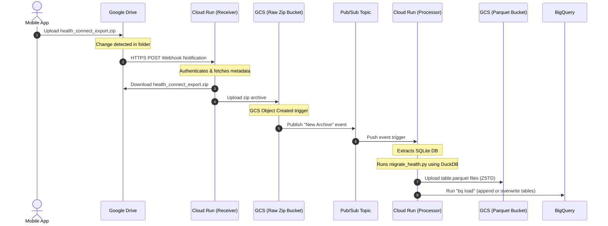

# GCP Event-Driven Pipeline Architecture Blueprint

This blueprint outlines the design for the automated, serverless, and **Always-Free Tier** eligible pipeline to ingest and analyze your Health Connect data.

---

## 🗺️ 1. System Architecture Diagram



---

## 📦 2. Component Design & Free-Tier Mappings

| Component | GCP Service | Role | Free Tier Coverage |
| :--- | :--- | :--- | :--- |
| **Storage (Raw)** | GCS Bucket (`raw-health-zip`) | Stores incoming `.zip` database backups. | Yes (Part of 5 GB standard limit) |
| **Storage (Processed)** | GCS Bucket (`processed-parquet`) | Stores compressed columnar `.parquet` files. | Yes (Part of 5 GB standard limit) |
| **Ingress Webhook** | Cloud Run (`drive-receiver`) | Receives webhooks from Google Drive and downloads the file. | Yes (Part of 2M requests/mo) |
| **Processing Engine** | Cloud Run (`parquet-migrator`) | Runs DuckDB/Python processing container on events. | Yes (Part of 360k vCPU-seconds/mo) |
| **Event Routing** | Cloud Pub/Sub | Connects GCS upload events to the processing engine. | Yes (Part of 10 GB/mo data limit) |
| **Data Warehouse** | Google BigQuery | Stores tables (`v_steps_daily`, etc.) for analytics. | Yes (10 GB storage / 1 TB query scan/mo) |
| **Watch Renewal** | Cloud Scheduler | Runs every 6 days to renew the Google Drive Watch Channel. | Yes (Part of 3 jobs/mo limit) |

---

## 🛠️ 3. Handling Google Drive Push Notifications

Because Google Drive webhooks have a **maximum expiration of 7 days**, we implement an automated channel renewal mechanism:

```
[ Cloud Scheduler (Every 6 Days) ]
             ↓ triggers
[ Cloud Run (drive-receiver /renew endpoint) ]
             ↓ sends
[ Drive API request: files.watch() with new UUID ]
```

### Authorization Requirements
1. **Domain Verification**: Your Cloud Run custom domain or default `run.app` domain must be verified in the Google Search Console/GCP Console to receive Drive API push notifications.
2. **Service Account**: A GCP Service Account is granted read access to your Google Drive backup folder.

---

## 📂 4. Project Directory Structure (IaC & Codebase)

Here is the proposed structure for the repository:

```text
health-pipeline/
├── terraform/                   # Infrastructure as Code
│   ├── main.tf                  # Project, Provider, and APIs
│   ├── storage.tf               # GCS Buckets
│   ├── pubsub.tf                # Eventarc / Pub/Sub configuration
│   ├── compute.tf               # Cloud Run services
│   ├── variables.tf             # Project & Region config
│   └── terraform.tfvars         # Credentials values
│
├── services/
│   ├── drive-receiver/          # Ingestion Microservice
│   │   ├── main.py              # Webhook receiver & download logic
│   │   ├── requirements.txt
│   │   └── Dockerfile
│   │
│   └── parquet-migrator/        # Processing Microservice
│       ├── main.py              # Cloud Run event wrapper
│       ├── migrate_health.py    # Database extraction logic
│       ├── requirements.txt
│       └── Dockerfile
│
└── README.md
```

---

## 🚀 5. Action Plan

To deploy this architecture:
1. **Scaffold Directory**: Initialize the folders and prepare the Python files.
2. **Terraform Scaffolding**: Write `main.tf` and `storage.tf` to configure the buckets and service accounts.
3. **Containerize**: Write the Dockerfiles for both services.
4. **Authentication Setup**: Document Google Drive API credentials setup (OAuth client/Service Account).
