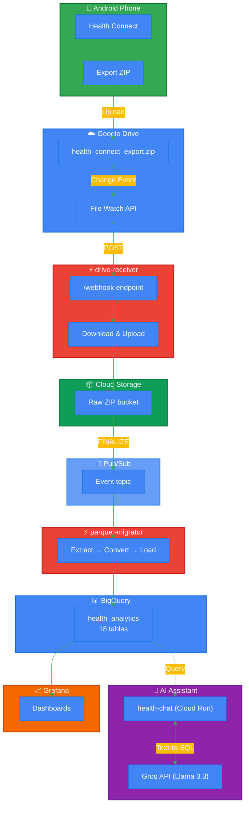

# Health Connect → BigQuery Pipeline & AI Assistant

A serverless pipeline that automatically syncs your Android Health Connect data to BigQuery for analysis, plus a personal AI health assistant to chat with your data. The entire setup runs on the GCP and Groq free tiers, so it won't cost you a dime.

## What it does

1. Exports your health data from Android Health Connect to Google Drive.
2. Detects new file uploads and streams the SQLite data to Cloud Storage.
3. Automatically extracts and converts the data to Parquet format.
4. Loads 18 health tables into BigQuery.
5. Lets you chat with your personal health data using an AI assistant (Llama 3.3 70B via Groq) that writes SQL on the fly.
6. Lets you build dashboards in Grafana if you prefer visual charts.

**Cost: $0/month** (Stays well within GCP and Groq free tier limits)

## Architecture

<div align="center">



</div>

**The Data Flow:** Phone → Drive → Cloud Run → Storage → Pub/Sub → Cloud Run → BigQuery → (AI Chatbot | Grafana)

## The Data We Collect

It grabs all the tables from Health Connect, such as:
- Steps, distance, and calories (both active & total)
- Heart rate (continuous readings + resting heart rate)
- Sleep sessions and stages (REM/Deep/Light/Awake)
- Exercise sessions, GPS routes, segments, and laps
- Body metrics like weight

There are 18 tables in total, giving you a very complete picture of your health.

## Setting It Up

### What you need
- A Google Cloud Platform (GCP) project with billing enabled (don't worry, we won't leave the free tier).
- A Google Drive account.
- An Android phone running Health Connect.
- A free API key from [Groq](https://console.groq.com) for the AI assistant.

### Quick Start
1. **Clone the repo**
   ```bash
   git clone https://github.com/sai7teja/Health-connect.git
   cd Health-connect
   ```
2. **Edit `setup.sh`** - Add your GCP project ID and Drive file ID at the top of the file.
3. **Run the script**
   ```bash
   chmod +x setup.sh
   ./setup.sh
   ```
This script automates almost everything: enabling APIs, setting up service accounts, building Docker images, and running Terraform to provision the infrastructure.

## How the Pieces Fit Together

### drive-receiver
A Cloud Run service that gets webhook notifications from Google Drive whenever your export file is updated. It downloads the ZIP file (handling streaming so we don't blow up memory) and puts it in Cloud Storage. Credentials live safely in Secret Manager.

### parquet-migrator
When Cloud Storage sees a new ZIP, it sends a Pub/Sub message to trigger this service. It uses DuckDB to extract the SQLite database from the ZIP, converts the tables to Parquet (for speed and compression), and loads them into BigQuery.

### health-chat (AI Assistant)
A standalone web app running on Cloud Run. It takes your natural language questions (like "How much deep sleep did I get this week?"), uses the Groq API (Llama 3.3 70B) to write a SQL query, runs that query against BigQuery, and then explains the results back to you conversationally. 

### Watch Renewal
Google Drive watch channels technically expire after about an hour, even if you ask for longer. So, we have a Cloud Scheduler job that runs every 45 minutes to renew the watch channel so we never miss an update.

## Security
- Absolutely no service account keys are committed to the codebase.
- Everything sensitive lives in GCP Secret Manager.
- While `drive-receiver` is public (needed for Drive webhooks), `parquet-migrator` is completely locked down and requires OIDC authentication via Pub/Sub.
- Your health data stays encrypted in transit and at rest.

## Cost Breakdown

We keep everything in the free tier bounds. Here is how that works out:

| Service | Free Tier Limit | Expected Usage |
|---------|-----------------|----------------|
| Cloud Run | 2M requests/month | ~50/month |
| Cloud Storage | 5 GB storage | ~200 MB |
| BigQuery | 10 GB storage, 1 TB queries/mo | ~25 MB storage, <1 GB queries |
| Pub/Sub | 10 GB/month | ~30 MB |
| Secret Manager | 6 secrets | 5 secrets |
| Groq API | 14,400 requests/day | ~10-20/day |

**Total expected cost: $0.00/month**

## Troubleshooting

**Not getting Drive updates?**
Manually renew the watch channel:
```bash
URL=$(gcloud run services describe drive-receiver --region=us-central1 --format="value(status.url)")
curl -X POST "${URL}/renew"
```

**BigQuery tables empty?**
Check if the migrator service got the message from Pub/Sub:
```bash
gcloud pubsub subscriptions pull parquet-migrator-gcs-trigger --limit=5 --project=YOUR_PROJECT
```

## Future Ideas
- Moving from full rewrites to incremental BigQuery loads.
- Support for multiple users (tracking family health).
- Setting up anomaly detection alerts (e.g., getting an email if your resting heart rate spikes).

## License
MIT - please feel free to fork, mess around, and modify it for your own needs.
