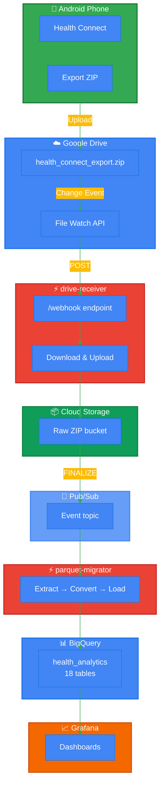

# Health Connect → BigQuery Pipeline

Automatically sync your Android Health Connect data to BigQuery for analysis and visualization. Built with GCP serverless services, runs entirely on the free tier.

## What it does

1. Export your health data from Android Health Connect to Google Drive
2. Pipeline automatically detects the file change
3. Extracts and converts SQLite data to Parquet format
4. Loads 18 health tables into BigQuery
5. Visualize in Grafana or query directly

**Cost: $0/month** (stays within GCP free tier limits)

## Architecture

<div align="center">



</div>

**Flow:** Phone → Drive → Cloud Run → Storage → Pub/Sub → Cloud Run → BigQuery → Grafana

## Data Available

All tables from Health Connect, including:
- Steps, distance, calories (active & total)
- Heart rate (continuous series + resting HR)
- Sleep sessions and stages (REM/Deep/Light/Awake)
- Exercise sessions, routes (GPS), segments, laps
- Body metrics (weight, height)

Full list: `steps_record`, `heart_rate_series`, `sleep_sessions`, `sleep_stages`, `exercise_sessions`, `distance`, `elevation_gained`, and 11 more.

## Setup

### Prerequisites

- GCP project with billing enabled (free tier is enough)
- Google Drive account
- Android phone with Health Connect

### Quick Start

1. **Clone and configure**
   ```bash
   git clone https://github.com/sai7teja/Health-connect.git
   cd Health-connect
   ```

2. **Edit `setup.sh`** - Set your project ID and Drive file ID at the top

3. **Run setup**
   ```bash
   chmod +x setup.sh
   ./setup.sh
   ```

The script handles everything: API enablement, service accounts, Docker builds, Terraform deployment.

### Manual Setup (if you prefer)

<details>
<summary>Click to expand step-by-step instructions</summary>

**1. Enable APIs**
```bash
gcloud services enable run.googleapis.com storage.googleapis.com \
  bigquery.googleapis.com pubsub.googleapis.com secretmanager.googleapis.com
```

**2. Create service account**
```bash
gcloud iam service-accounts create health-pipeline-sa
SA_EMAIL="health-pipeline-sa@YOUR_PROJECT.iam.gserviceaccount.com"

# Grant permissions
for ROLE in roles/storage.objectAdmin roles/bigquery.admin roles/secretmanager.secretAccessor; do
  gcloud projects add-iam-policy-binding YOUR_PROJECT \
    --member="serviceAccount:${SA_EMAIL}" --role="${ROLE}"
done
```

**3. Store credentials in Secret Manager**
```bash
gcloud iam service-accounts keys create /tmp/sa-key.json --iam-account="${SA_EMAIL}"
gcloud secrets create drive-sa-credentials --data-file=/tmp/sa-key.json
rm /tmp/sa-key.json  # Important: delete local copy
```

**4. Share Drive file with service account**
- Open your health export ZIP in Drive
- Share with `health-pipeline-sa@YOUR_PROJECT.iam.gserviceaccount.com` (Viewer)

**5. Build and deploy**
```bash
# Build containers
gcloud builds submit services/drive-receiver/ --tag gcr.io/YOUR_PROJECT/drive-receiver
gcloud builds submit services/parquet-migrator/ --tag gcr.io/YOUR_PROJECT/parquet-migrator

# Deploy with Terraform
cd terraform
terraform init
terraform apply
```

**6. Set up webhook**
```bash
URL=$(gcloud run services describe drive-receiver --region=us-central1 --format="value(status.url)")
curl -X POST "${URL}/renew"  # Register Drive watch channel
```

</details>

## How it Works

### drive-receiver
- Receives webhook notifications from Google Drive when file changes
- Downloads the ZIP file (streaming, handles large files)
- Uploads to Cloud Storage
- Credentials fetched from Secret Manager (no keys on disk)

### parquet-migrator
- Triggered by Cloud Storage events via Pub/Sub
- Extracts SQLite database from ZIP
- Converts all tables to Parquet format (DuckDB + ZSTD compression)
- Loads into BigQuery with WRITE_TRUNCATE

### Watch Renewal
Cloud Scheduler runs every 45 minutes to renew the Drive watch channel (Drive expires them after ~1 hour despite longer TTL requests).

## Grafana Setup

1. Add BigQuery datasource in Grafana
2. Upload the service account key (or create a separate read-only SA)
3. Set default project and dataset

Example queries:
```sql
-- Daily steps
SELECT DATE(TIMESTAMP_MILLIS(start_time)) as date, SUM(count) as steps
FROM `project.health_analytics.steps_record_table`
GROUP BY date
ORDER BY date

-- Sleep duration by night
SELECT DATE(TIMESTAMP_MILLIS(start_time)) as night,
  (end_time - start_time) / 3600000.0 as hours
FROM `project.health_analytics.sleep_session_record_table`
ORDER BY night
```

## Security

- No service account keys stored in code
- Credentials in Secret Manager only
- `drive-receiver` is public (required for Drive webhooks)
- `parquet-migrator` is private (OIDC-authenticated Pub/Sub only)
- All data encrypted in transit and at rest

## Cost Breakdown

Everything runs on GCP free tier:

| Service | Free Tier | Usage |
|---------|-----------|-------|
| Cloud Run | 2M requests/mo | ~30/mo |
| Cloud Storage | 5 GB | ~200 MB |
| BigQuery | 10 GB storage, 1 TB queries/mo | ~200 MB storage |
| Pub/Sub | 10 GB/mo | ~30 MB |
| Secret Manager | 6 secrets | 1 secret |

**Total: $0/month**

## Troubleshooting

**Drive webhook not working?**
```bash
# Check watch channel status
URL=$(gcloud run services describe drive-receiver --region=us-central1 --format="value(status.url)")
curl -X POST "${URL}/renew"
```

**Pub/Sub not triggering?**
```bash
gcloud pubsub subscriptions pull parquet-migrator-gcs-trigger --limit=5
```

**BigQuery tables missing?**
```bash
bq ls YOUR_PROJECT:health_analytics
```

## Known Issues

- Drive watch channels expire after ~1 hour (auto-renewed every 45 min by Cloud Scheduler)
- Full table rewrite on every run (no incremental updates yet)
- Sleep data coverage depends on wearable device compatibility

## Future Ideas

- Incremental BigQuery loads (only new records)
- Multiple user support (separate Drive files)
- Anomaly detection alerts (unusual heart rate, poor sleep)
- ML-based health insights

## License

MIT - feel free to fork and modify

---

Built for personal health tracking. Not affiliated with Google or Health Connect.
