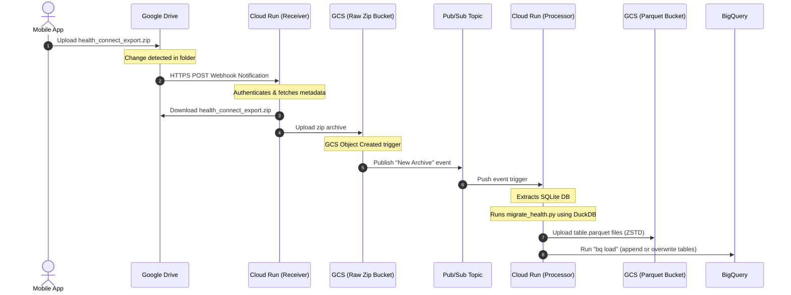

# GCP Event-Driven Pipeline Architecture Blueprint

This blueprint outlines the design for the automated, serverless, and **Always-Free Tier** eligible pipeline to ingest and analyze your Health Connect data.

---

## 🗺️ 1. System Architecture Diagram



---

## 📦 2. Component Design & Free-Tier Mappings

| Component | GCP Service | Role | Free Tier Coverage |
| :--- | :--- | :--- | :--- |
| **Storage (Raw)** | GCS Bucket (`raw-health-zip`) | Stores incoming `.zip` database backups. | Yes (Part of 5 GB standard limit) |
| **Storage (Processed)** | GCS Bucket (`processed-parquet`) | Stores compressed columnar `.parquet` files. | Yes (Part of 5 GB standard limit) |
| **Ingress Webhook** | Cloud Run (`drive-receiver`) | Receives webhooks from Google Drive and downloads the file. | Yes (Part of 2M requests/mo) |
| **Processing Engine** | Cloud Run (`parquet-migrator`) | Runs DuckDB/Python processing container on events. | Yes (Part of 360k vCPU-seconds/mo) |
| **Event Routing** | Cloud Pub/Sub | Connects GCS upload events to the processing engine. | Yes (Part of 10 GB/mo data limit) |
| **Data Warehouse** | Google BigQuery | Stores tables (`v_steps_daily`, etc.) for analytics. | Yes (10 GB storage / 1 TB query scan/mo) |
| **Watch Renewal** | Cloud Scheduler | Runs every 6 days to renew the Google Drive Watch Channel. | Yes (Part of 3 jobs/mo limit) |

---

## 🛠️ 3. Handling Google Drive Push Notifications

Because Google Drive webhooks have a **maximum expiration of 7 days**, we implement an automated channel renewal mechanism:

<details>
  <summary>Click here to reveal the hidden text</summary>
  
   Yes, there is a specific limitation highlighted in Step 3 of the  gcp_architecture_blueprint.md  file.

  The limitation states:

  │ "Because Google Drive webhooks have a maximum expiration of 7 days, we implement an automated channel renewal
  │ mechanism."

  This means that Google Drive API Push Notifications (webhooks) cannot be set to listen indefinitely. They expire
  automatically, and you are required to constantly recreate or renew the watch channel to continue receiving
  updates.

  ### Proof & Documentation

  I performed a web search to fetch the official limitations from the Google Drive API documentation. Here are the
  exact constraints:

  1. Maximum Expiration Limits:
  Depending on the specific resource you are watching, Google enforces strict maximum time-to-live (TTL) limits for
  push notification channels:
      • Changes resource: The absolute maximum expiration time is 604,800 seconds (1 week).
      • Files resource: The absolute maximum expiration time is 86,400 seconds (1 day).
      • Default: If you do not specify an expiration time in your request, it defaults to just 3,600 seconds (1 hour).
  2. No Permanent Webhooks:
  For security reasons, the API does not offer a "never expire" option.
  3. Renewal Process:
  There is no "auto-renew" feature provided by Google. When a channel approaches its expiration, the application must
  explicitly call the  watch  method again to create a brand new channel with a new, unique  id .

  This completely validates the architecture in the blueprint! Setting up a Cloud Scheduler job to run every 6 days
  (as specified in the blueprint) is the officially recommended best practice for bypassing this limitation so your
  pipeline doesn't suddenly stop receiving webhook events.

  Reference Documentation:

  • Google Workspace For Developers: Push Notifications - Expiration https://developers.google.
  com/drive/api/guides/push

  
</details>

```
[ Cloud Scheduler (Every 6 Days) ]
             ↓ triggers
[ Cloud Run (drive-receiver /renew endpoint) ]
             ↓ sends
[ Drive API request: files.watch() with new UUID ]
```

### Authorization Requirements
1. **Domain Verification**: Your Cloud Run custom domain or default `run.app` domain must be verified in the Google Search Console/GCP Console to receive Drive API push notifications.
2. **Service Account**: A GCP Service Account is granted read access to your Google Drive backup folder.

---

## 📂 4. Project Directory Structure (IaC & Codebase)

Here is the proposed structure for the repository:

```text
health-pipeline/
├── terraform/                   # Infrastructure as Code
│   ├── main.tf                  # Project, Provider, and APIs
│   ├── storage.tf               # GCS Buckets
│   ├── pubsub.tf                # Eventarc / Pub/Sub configuration
│   ├── compute.tf               # Cloud Run services
│   ├── variables.tf             # Project & Region config
│   └── terraform.tfvars         # Credentials values
│
├── services/
│   ├── drive-receiver/          # Ingestion Microservice
│   │   ├── main.py              # Webhook receiver & download logic
│   │   ├── requirements.txt
│   │   └── Dockerfile
│   │
│   └── parquet-migrator/        # Processing Microservice
│       ├── main.py              # Cloud Run event wrapper
│       ├── migrate_health.py    # Database extraction logic
│       ├── requirements.txt
│       └── Dockerfile
│
└── README.md
```

---

## 🚀 5. Action Plan

To deploy this architecture:
1. **Scaffold Directory**: Initialize the folders and prepare the Python files.
2. **Terraform Scaffolding**: Write `main.tf` and `storage.tf` to configure the buckets and service accounts.
3. **Containerize**: Write the Dockerfiles for both services.
4. **Authentication Setup**: Document Google Drive API credentials setup (OAuth client/Service Account).
